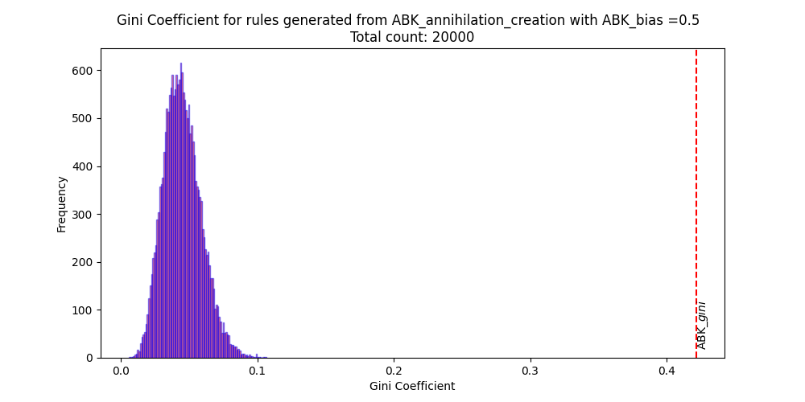
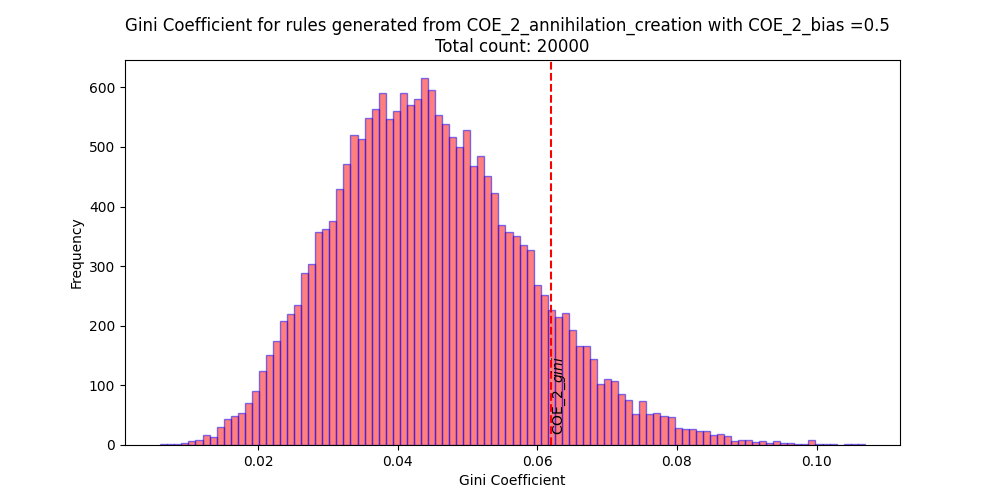
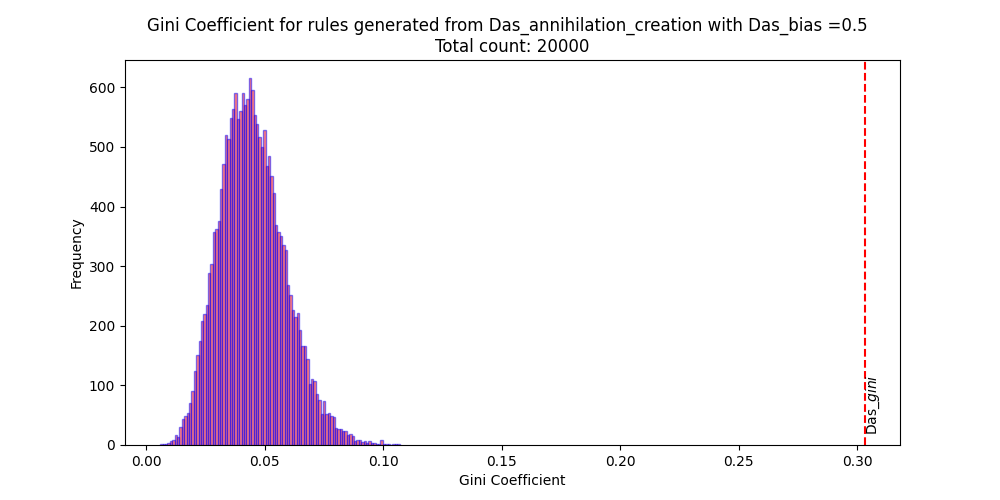
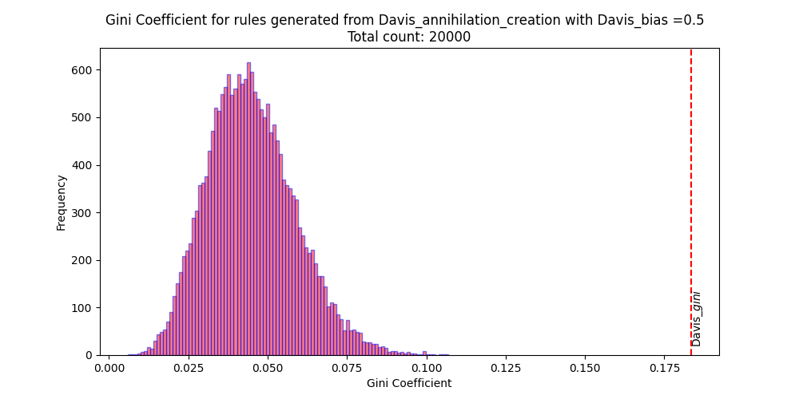
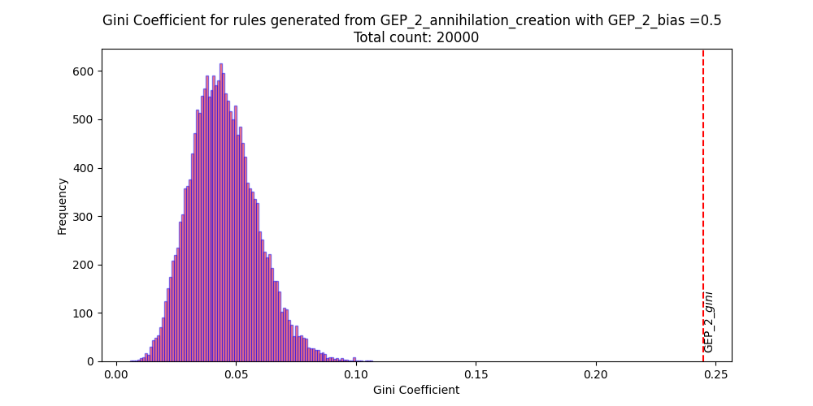
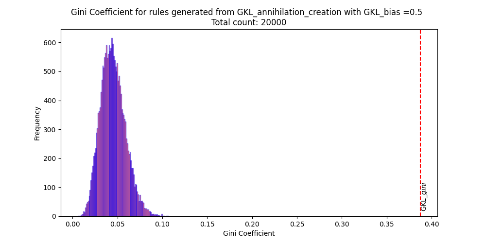
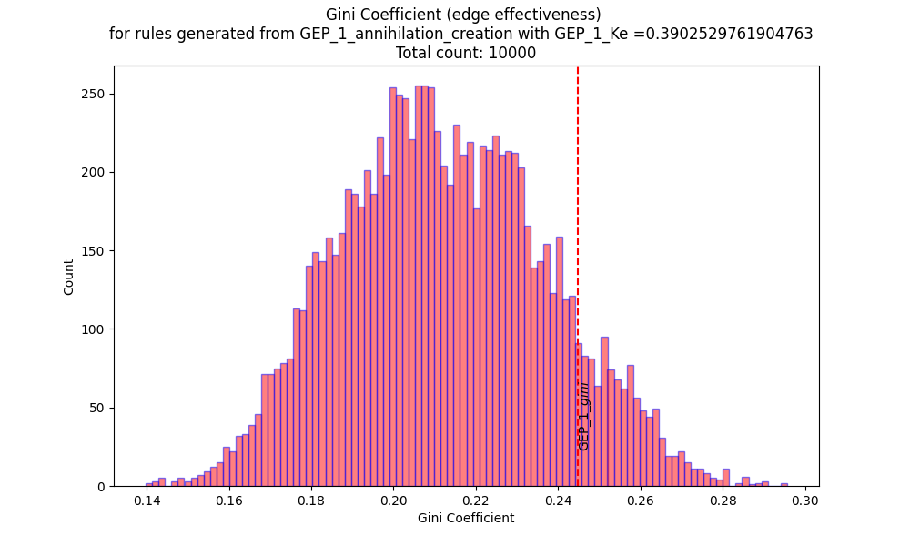
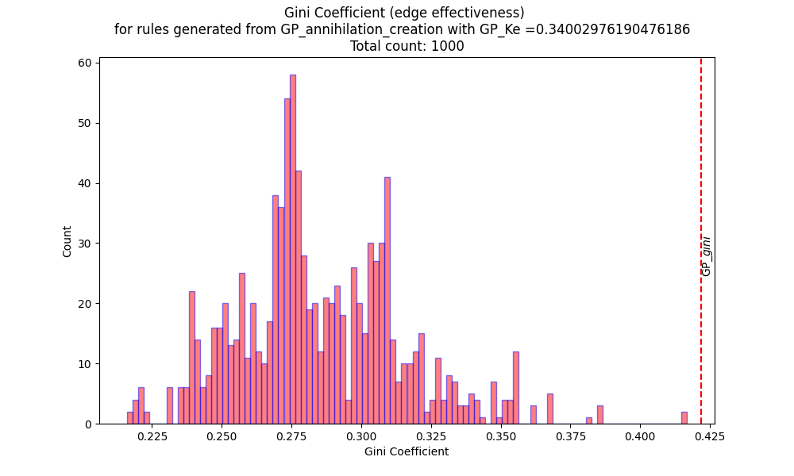
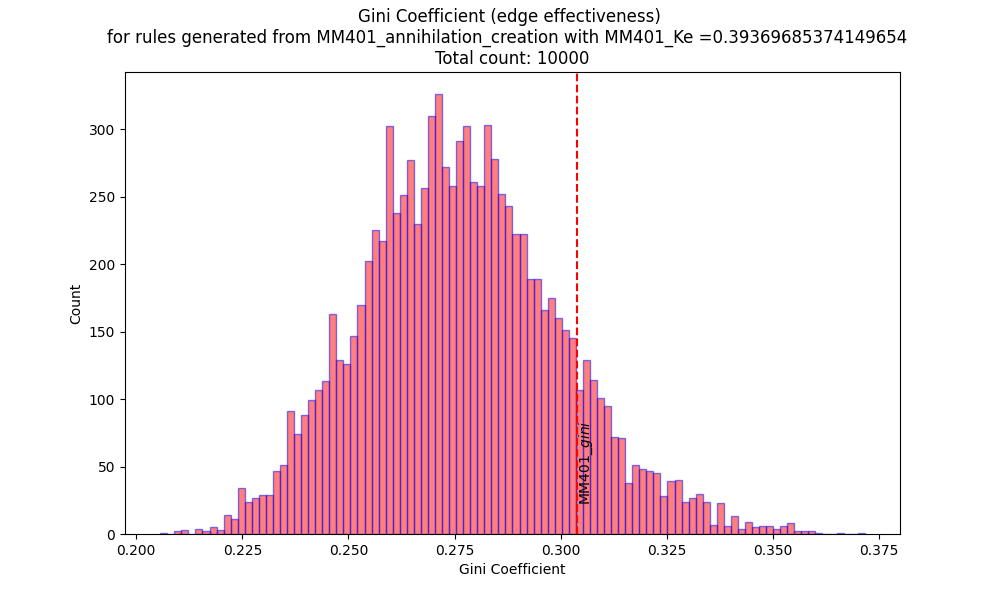

# Generating complete LUTs from annihilation generation rules

Generating for a given $K_e$ or a given Bias is quick and straighforward.

## Generating new rules with parent rule bias and $K_e$

Generating LUTs similar to the parent rule's $K_e$ and Bias (both together) is not so simple.
Most famous DCT rules have a bias of 0.5.
However, most rules generated with that bias tend to have a much higher $K_e$ than the parent rule.

### Existing DCT rules have a rare combination of Bias and $K_e$

#### $K_e$ of generated rules with parent rule bias

Below are the histograms of the $K_e$ of new rules generated with the parent rule bias.

COE_1 $K_e$ is easier to replicate via annihilation generation when generated with the parent rule bias. The rest, not so much.

#### Bias of rules generated with parent rule $K_e$

Below are the histograms of the bias of new rules generated with the parent rule $K_e$.

Randomly sampled across the permutation space, the bias of generated rules are far away from the bias of the parent rule when generated from the parent rule $K_e$.

### Looking at edge effectiveness of rules

(Gates et al., 2021) Shows an interesting difference in the gini coefficient of biological networks in the cell collective and that of random boolean networks.  Where do the DCT rules lie in that comparison?

**From annihilation generation rules with parent rule bias criterion**\
Below are the plots of the edge-efectiveness Gini coefficient of the DCT rules and the rules generated from annihilation and generation rules and with the parent rule bias.

**From annihilation generation rules with parent rule $K_e$ criterion**\
Also, below are the plots of the edge-efectiveness Gini coefficient of the DCT rules and the rules generated from annihilation and generation rules and with the parent rule $K_e$.

Gates, A. J., Brattig Correia, R., Wang, X., & Rocha, L. M. (2021). The effective graph reveals redundancy, canalization, and control pathways in biochemical regulation and signaling. Proceedings of the National Academy of Sciences, 118(12), e2022598118. <https://doi.org/10.1073/pnas.2022598118>
