# Generating complete LUTs from annihilation generation rules
Generating for a given $K_e$ or a given Bias is quick and straighforward.

## Generating new rules with parent rule bias and $K_e$
Generating LUTs similar to the parent rule's $K_e$ and Bias (both together) is not so simple. 
Most famous DCT rules have a bias of 0.5. 
However, most rules generated with that bias tend to have a much higher $K_e$ than the parent rule. 

### Existing DCT rules have a rare combination of Bias and $K_e$
#### $K_e$ of generated rules with parent rule bias
Below are the histograms of the $K_e$ of new rules generated with the parent rule bias.
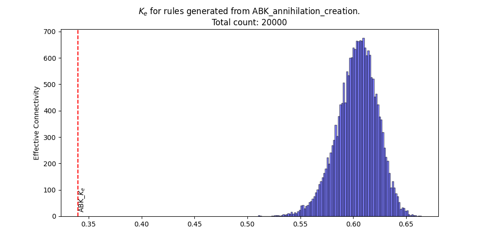 
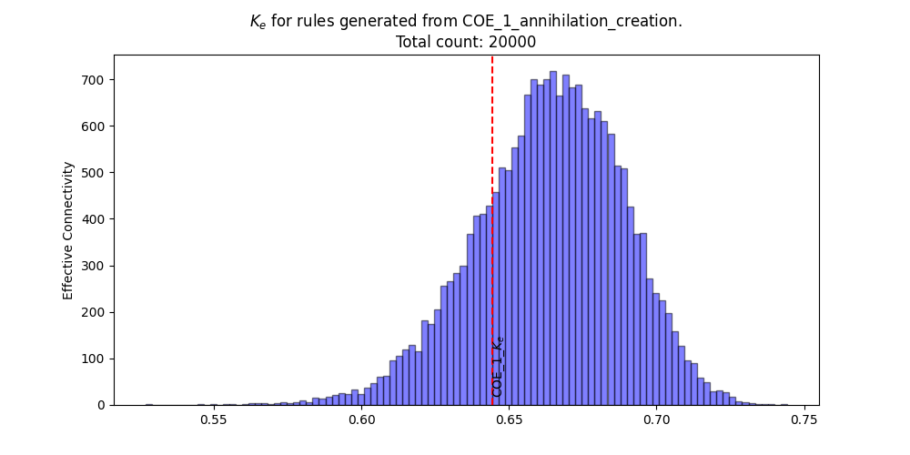 
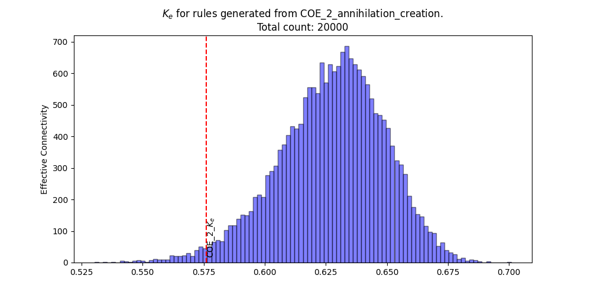 
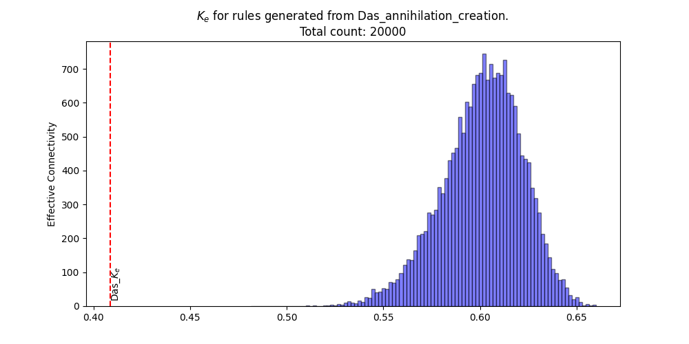 
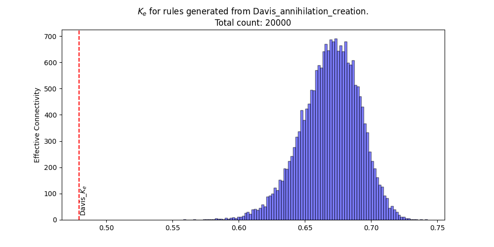 
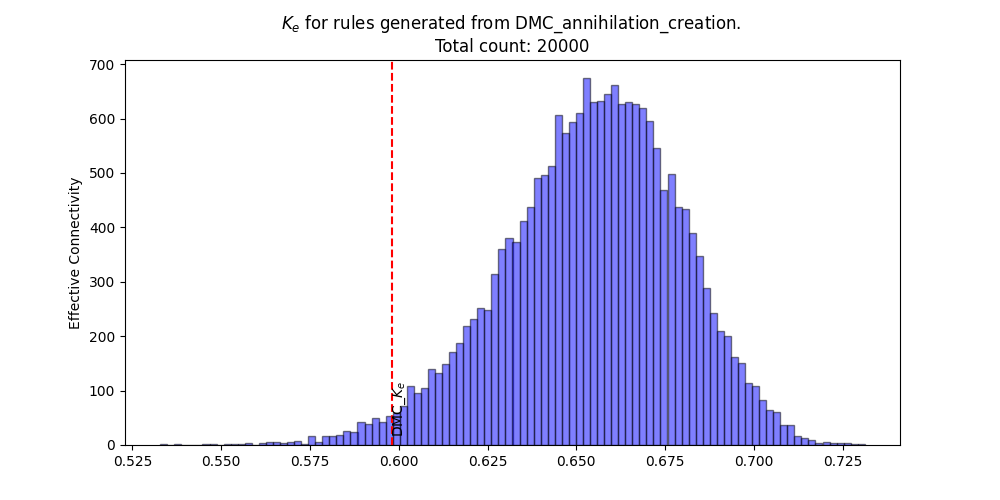 
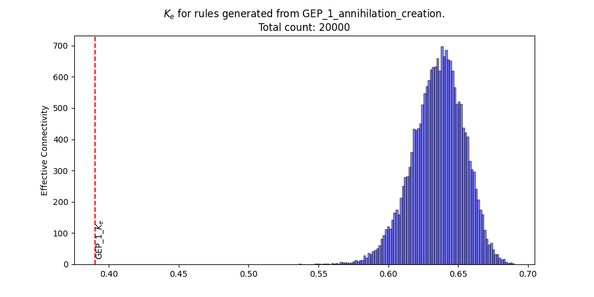 
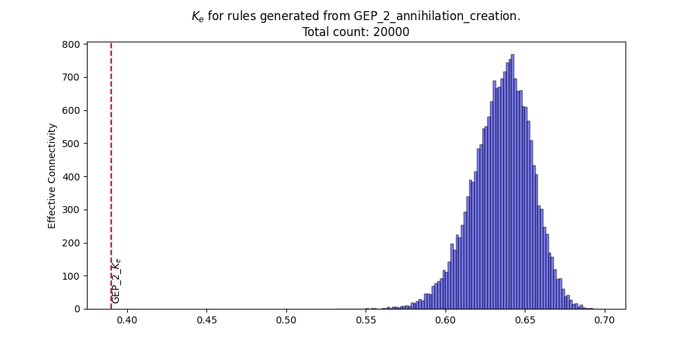 
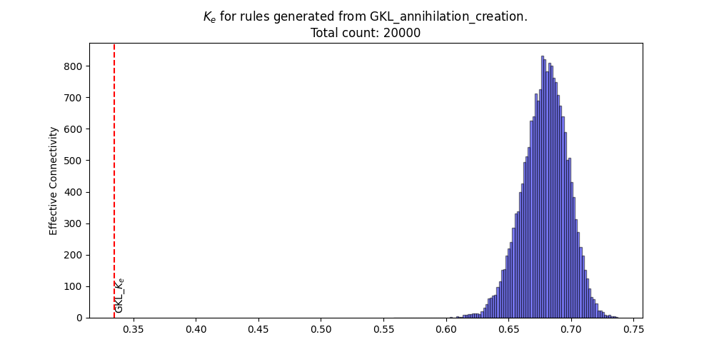 
 
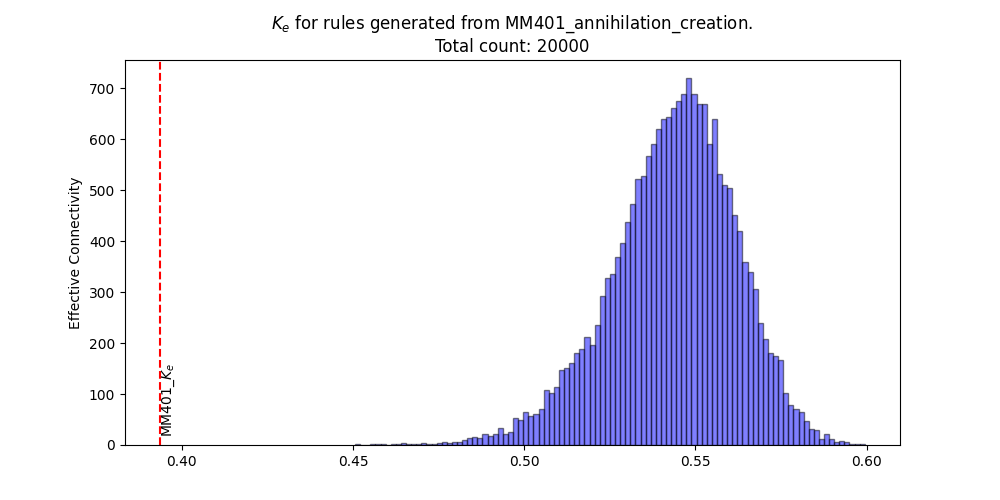

COE_1 $K_e$ is easier to replicate via annihilation generation. The rest, not so much. 

#### Bias of generated rules with parent rule Ec
Below are the histograms of the bias of new rules generated with the parent rule $K_e$.
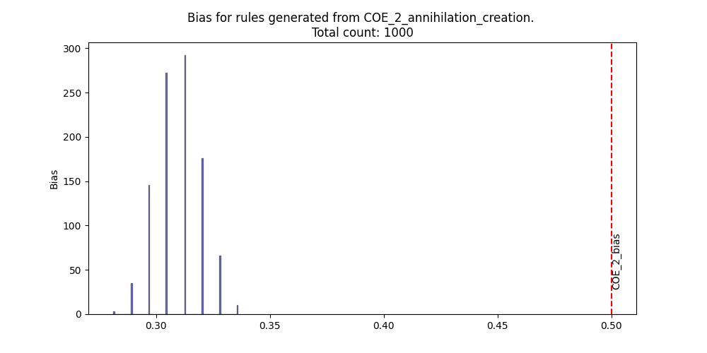 
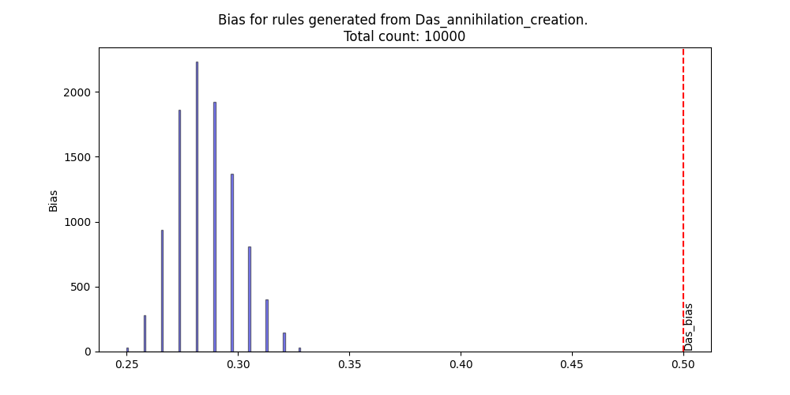 
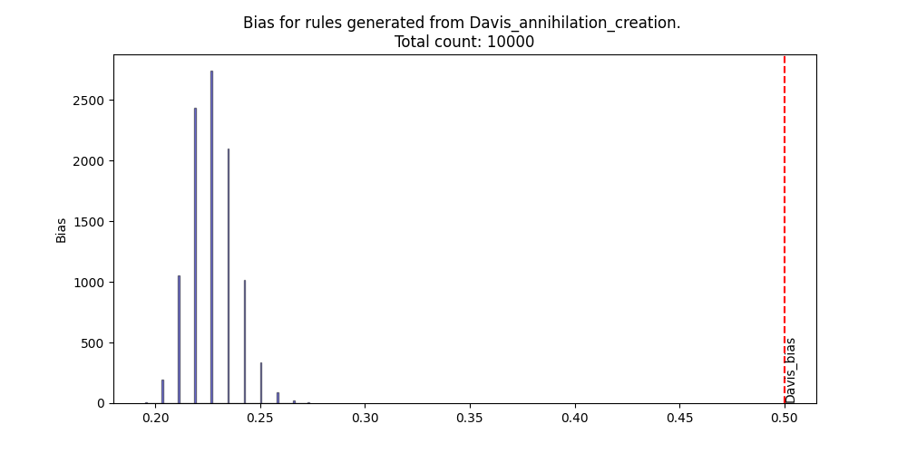 
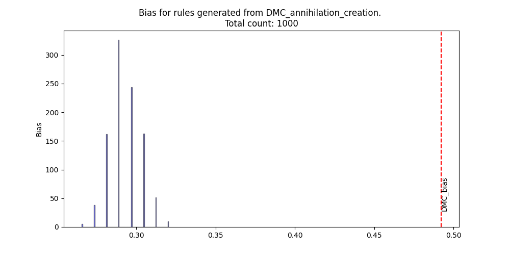 
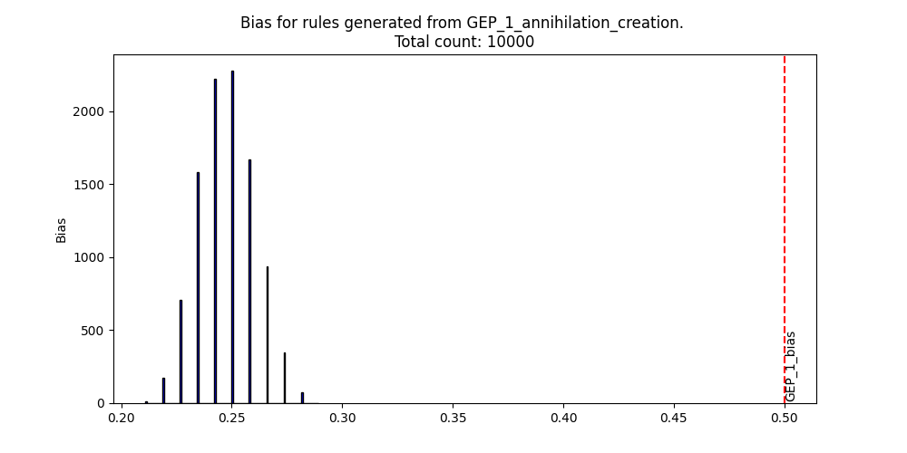 
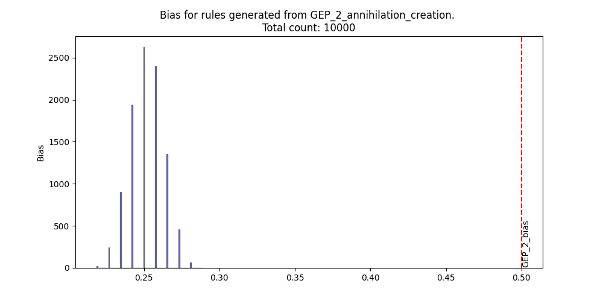 
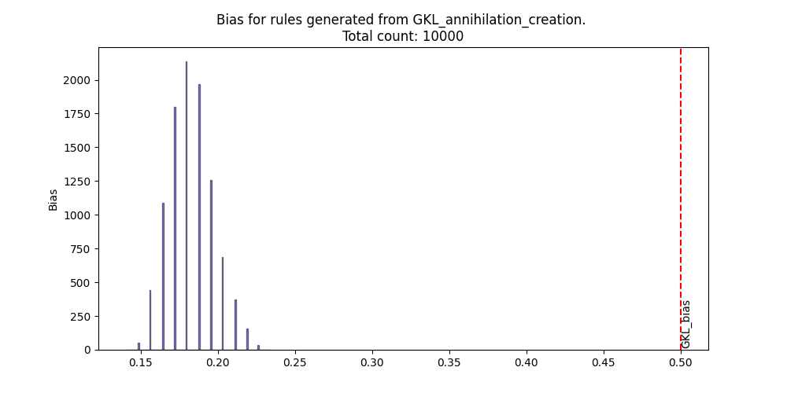 
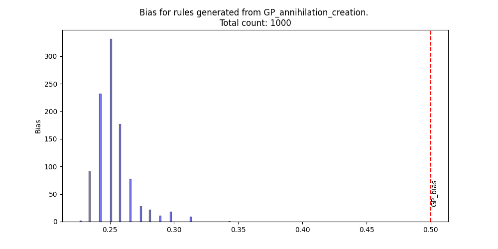 
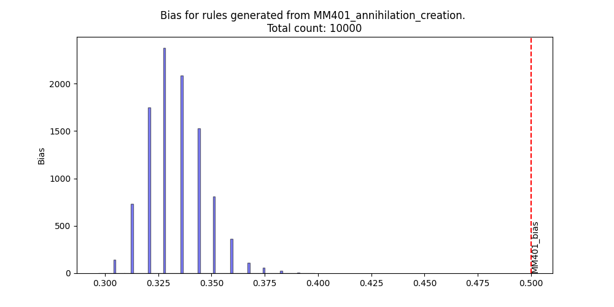

Randomly sampled across the permutation space, the bias of generated rules are far away from the bias of the parent rule. 